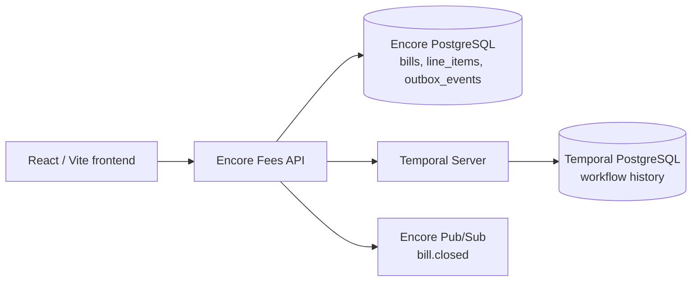

# Fees API

An Encore Go service for period-based fee billing. A bill starts a durable Temporal workflow, accepts idempotent line items while open, and closes into an immutable invoice at an explicit request or the billing-period end.

## What it provides

- Bills in a single immutable currency: `GEL` or `USD`.
- Progressive, idempotent line-item accrual in integer minor units.
- A Temporal workflow per bill for durable updates and period-end closure.
- PostgreSQL row locking as the final add-versus-close integrity boundary.
- An immutable invoice and a transactional `bill.closed` outbox event on closure.
- A React UI for creating bills, adding items, reviewing totals, and closing bills.

GEL uses tetri and USD uses cents. The service never converts or combines currencies: every line item must match its bill’s currency.

## Architecture



The local `temporal-postgres` Docker container is Temporal Server’s persistence store. Financial data uses the Encore-managed `fees` PostgreSQL database.

## Repository layout

```text
fees/
├── api.go                 # Encore endpoints
├── service.go             # Lifecycle, Temporal worker, service dependencies
├── outbox.go              # bill.closed relay
├── contracts.go           # API DTOs and domain mapping
├── migrations/
│   └── 1_create_billing_tables.up.sql
├── config/                # Temporal configuration
├── domain/                # Currency, lifecycle, validation, totals
├── database/              # PostgreSQL repository and transaction tests
└── temporal/              # Workflow, activities, timer tests
frontend/                  # React/Vite user interface
docker-compose.temporal.yml
```

See [the technical specification](docs/fees-api-tech-spec.md) for the ERD, API details, workflow behavior, and known limitations.

## Prerequisites

- Go 1.22 or later
- [Encore](https://encore.dev/docs/go/install)
- Docker Desktop or a compatible Docker daemon
- Node.js and npm for frontend development

## Run locally

Start Temporal and its local persistence database:

```bash
docker compose -f docker-compose.temporal.yml up -d
```

Start the Encore application:

```bash
encore run
```

Endpoints and UI:

- App and embedded frontend: `http://localhost:4000`
- Encore dashboard: `http://localhost:9400`
- Temporal UI: `http://localhost:8080`

The default Temporal settings are:

```text
FEES_TEMPORAL_ADDRESS=127.0.0.1:7233
FEES_TEMPORAL_NAMESPACE=default
FEES_TEMPORAL_TASK_QUEUE=fees-bills
```

## API workflow

All mutating requests require `Idempotency-Key`.

Create a USD bill:

```bash
curl -X POST http://localhost:4000/v1/bills \
  -H "Content-Type: application/json" \
  -H "Idempotency-Key: create-merchant-123-2026-08" \
  -d '{"owner_id":"merchant_123","currency":"USD","period_start":"2026-08-01T00:00:00Z","period_end":"2026-09-01T00:00:00Z"}'
```

Store the returned ID as `bill_id`, then add a matching-currency line item:

```bash
curl -X POST http://localhost:4000/v1/bills/{bill_id}/items \
  -H "Content-Type: application/json" \
  -H "Idempotency-Key: usage-usd-001" \
  -d '{"description":"API usage","currency":"USD","amount":2000,"source":"usage-service"}'
```

Read the current bill projection:

```bash
curl "http://localhost:4000/v1/bills/{bill_id}"
```

Close the bill:

```bash
curl -X POST http://localhost:4000/v1/bills/{bill_id}/close \
  -H "Idempotency-Key: close-merchant-123-2026-08"
```

The close response contains the final native-currency total, complete line-item snapshot, status, and closure time. A GEL line item on this USD bill is rejected with `currency_mismatch`.

The endpoints are currently public and accept caller-supplied `owner_id` values. They are suitable for local development only until authentication and owner authorization are added.

## Development and verification

Backend:

```bash
encore test ./...
encore check
```

Frontend:

```bash
cd frontend
npm ci
npm test -- --runInBand
npm run build
```

`encore check` compiles, applies local migrations, and boots the application.

## Database reset

The current schema is intentionally a single reset-only migration for local development. To recreate the local Fees database after changing migration history:

```bash
encore db reset fees
```

Do not rewrite applied migrations in a deployed environment; create a new forward migration instead.
