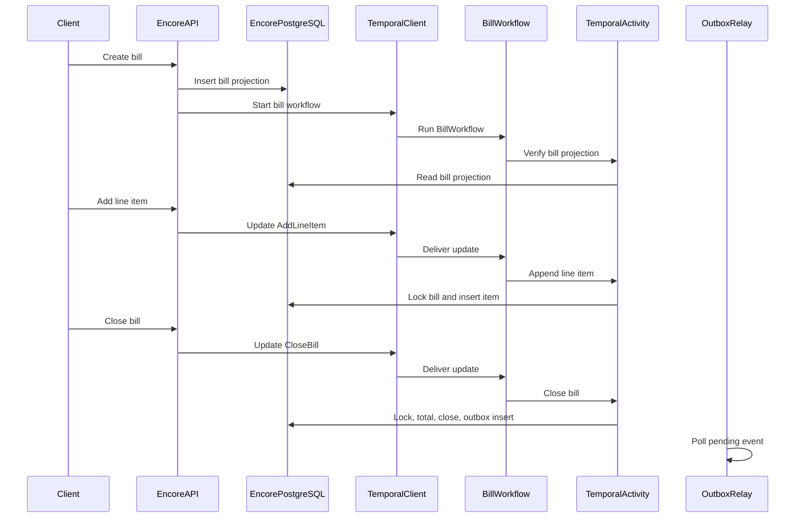
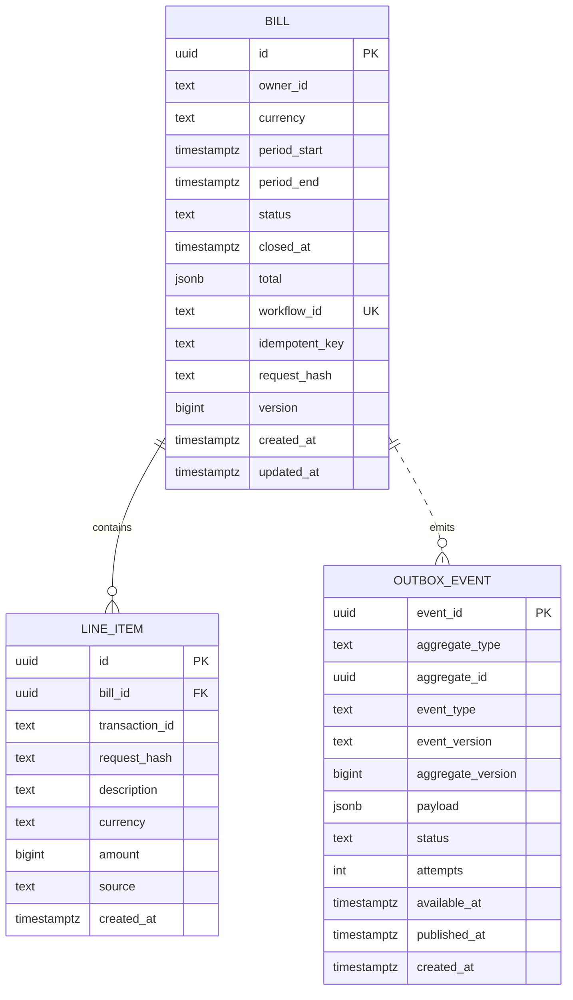

# Fees API Technical Specification

**Status:** Implemented  
**Scope:** GEL and USD billing through an Encore Go service, PostgreSQL projection, and Temporal workflow.

## 1. Overview

The Fees API creates a bill at the beginning of a fee period, accepts progressive line-item accrual while it is open, and closes the bill into an immutable invoice.

Each bill has one immutable currency: `GEL` or `USD`. Every line item must use that same currency. The service does not perform FX conversion, combine currencies, or use floating-point arithmetic.

Temporal provides durable workflow execution, update delivery, retryable activities, and a period-end timer. Encore PostgreSQL stores the authoritative bill, line-item, and outbox projection; its row locks are the final add-versus-close ordering boundary.

## 2. Architecture



The local `temporal-postgres` container in `docker-compose.temporal.yml` is exclusively Temporal Server’s persistence database. Fees data uses Encore’s `fees` PostgreSQL database, defined with `sqldb.NewDatabase("fees", ...)`.

## 3. Package layout

```text
fees/
├── api.go                 # Encore public endpoint methods
├── service.go             # Encore service lifecycle and Temporal worker
├── outbox.go              # Outbox relay owned by the service
├── contracts.go           # Encore request/response DTOs and boundary mapping
├── encore.gen.go          # Generated Encore code; do not edit
├── migrations/
│   └── 1_create_billing_tables.up.sql
├── config/
│   └── config.go          # Temporal environment configuration
├── database/
│   ├── repository.go      # SQL transactions and row locking
│   └── repository_test.go
├── domain/
│   ├── errors.go
│   ├── models.go          # Money, bill lifecycle, validation, totals
│   └── models_test.go
└── temporal/
    ├── workflow.go        # Workflow, updates, and activities
    └── workflow_test.go
```

`fees/` remains the thin service/controller boundary because Encore requires endpoint methods and the `//encore:service` type to be in the service package. `contracts.go` contains concrete named DTOs because Encore API schemas cannot use type aliases as endpoint responses.

## 4. Domain model

### Bill lifecycle

```text
OPEN --CloseBill or period-end timer--> CLOSED
```

Only `OPEN` bills accept line items. `CLOSED` is terminal; no edit, delete, or reopen endpoint exists.

### Currency and money

- Supported bill currencies: `GEL`, `USD`.
- GEL amounts are stored in tetri; USD amounts are stored in cents.
- Amounts are positive signed 64-bit integer minor units.
- A bill’s `currency` is selected at creation and cannot change.
- A line item’s currency must equal its bill currency.
- Closing creates one `total` entry in the bill currency.
- Integer addition checks for `int64` overflow.

Example:

```json
{
  "currency": "USD",
  "amount": 2000
}
```

represents USD 20.00.

## 5. Database schema



### Constraints and invariants

- `bills.currency` and `line_items.currency` are constrained to `GEL` or `USD`.
- `bills.period_end` must be after `period_start`.
- `bills.status` is `OPEN` or `CLOSED`.
- An open bill has `total` and `closed_at` set to `NULL`; a closed bill has both populated.
- `(owner_id, period_start, period_end)` is unique.
- `(owner_id, idempotent_key)` is unique for create retries.
- `(bill_id, transaction_id)` is unique for line-item retries.
- `line_items.amount > 0`.
- `(aggregate_type, aggregate_id, aggregate_version, event_type)` is unique for outbox deduplication.

The database constraint does not directly compare a line item’s currency with its bill currency. The repository enforces it after locking the bill row with `SELECT ... FOR UPDATE`, so a mismatched item returns `currency_mismatch` and cannot be accepted concurrently with closure.

## 6. API

Base path: `/v1`.

All mutation endpoints require an `Idempotency-Key` header. The API is currently public and uses supplied `owner_id` values; authentication and owner authorization are not implemented.

### Create bill

`POST /v1/bills`

```json
{
  "owner_id": "merchant_123",
  "currency": "USD",
  "period_start": "2026-08-01T00:00:00Z",
  "period_end": "2026-09-01T00:00:00Z"
}
```

The service writes the bill projection first, then starts the deterministic workflow `bill-{bill_uuid}`. Reusing the same idempotency key and request body returns the existing bill; a changed body returns a conflict.

### List bills

`GET /v1/bills?owner_id=merchant_123`

Returns bills ordered by descending period start.

### Get bill

`GET /v1/bills/{bill_id}`

Returns the current PostgreSQL projection: bill status, currency, line items, and total. `total` is unset while the bill is open and becomes one `{currency, amount}` entry after closure.

### Add line item

`POST /v1/bills/{bill_id}/items`

```json
{
  "description": "API usage",
  "currency": "USD",
  "amount": 1250,
  "source": "usage-service"
}
```

The line-item currency must match the bill currency. A closed bill returns `bill_closed`; a mismatch returns `currency_mismatch`.

### Close bill

`POST /v1/bills/{bill_id}/close`

The request body is empty. Closing returns the immutable invoice:

```json
{
  "id": "b7f1...",
  "status": "CLOSED",
  "currency": "USD",
  "total": [
    { "currency": "USD", "amount": 2000 }
  ],
  "line_items": [
    {
      "transaction_id": "usage-001",
      "description": "API usage",
      "currency": "USD",
      "amount": 2000,
      "source": "usage-service"
    }
  ],
  "closed_at": "2026-09-01T00:00:03Z",
  "version": 2
}
```

Repeated close requests return the stored invoice after the bill reaches `CLOSED`.

## 7. Temporal behavior

Each bill has one workflow with ID `bill-{bill_uuid}` on task queue `fees-bills` by default.

`BillWorkflow`:

1. Registers `AddLineItem` and `CloseBill` update handlers.
2. Calls `CreateBillProjection` to verify the persisted bill belongs to the workflow.
3. Waits for an explicit close update or a timer scheduled for `period_end`.
4. Uses `CloseBill` for either closure path.
5. Returns the invoice or an automatic-close error.

Activities are the only Temporal code that performs database I/O:

- `CreateBillProjection` verifies the bill projection.
- `AppendLineItem` locks the bill and persists an idempotent item.
- `CloseBill` locks the bill, calculates the native-currency total, transitions to `CLOSED`, and creates an outbox event in one transaction.

Activity retries use a bounded exponential policy: initial delay one second, maximum delay ten seconds, maximum five attempts. Business-state failures are non-retryable Temporal application errors.

## 8. Consistency and idempotency

- Temporal provides durable workflow updates; PostgreSQL row locks are the final ordering boundary.
- PostgreSQL row locks are the final integrity boundary if another writer bypasses Temporal.
- Add versus close is deterministic: whichever locks the bill first wins; an add after close receives `bill_closed`.
- At the repository layer, a repeated line-item transaction ID returns the original item when the request hash matches and returns a conflict when it differs.
- The close transaction derives the total only from persisted items; clients cannot submit a bill total.
- The closed invoice and outbox event commit atomically.

## 9. Outbox

The close transaction inserts a `bill.closed` event containing the immutable invoice. The service polls pending events once per second, publishes to the Encore `bill-closed` topic with at-least-once delivery, then marks the row `PUBLISHED`.

If publishing fails, the event stays pending and the next relay cycle retries it. Consumers must deduplicate by `event_id`. The `attempts` and `available_at` columns are present in the schema but are not currently updated by the relay.

## 10. Configuration and local development

Temporal configuration uses environment variables:

```text
FEES_TEMPORAL_ADDRESS=127.0.0.1:7233
FEES_TEMPORAL_NAMESPACE=default
FEES_TEMPORAL_TASK_QUEUE=fees-bills
```

Start local Temporal dependencies and the application:

```bash
docker compose -f docker-compose.temporal.yml up -d
encore run
```

The Temporal UI is available at `http://localhost:8080`.

The root README contains an end-to-end curl example.

## 11. Tests and verification

Current automated coverage:

- `fees/domain`: currency validation, integer totals, overflow, and mismatch rejection.
- `fees/database`: transactional close, outbox persistence, currency mismatch, and add-after-close.
- `fees/temporal`: deterministic workflow ID and automatic-close behavior.
- `frontend`: dashboard, creation navigation, empty states, native-currency total rendering, and money formatting.

Run:

```bash
encore test ./...
encore check
cd frontend
npm test -- --runInBand
npm run build
```

## 12. Current limitations

- No authentication or authorization is enforced.
- An automatic close permanently fails its workflow after retry exhaustion; there is no automated repair workflow.
- Workflow startup is asynchronous, so an immediate update can encounter a transient workflow-not-found failure.
- The API uses the line-item idempotency key as the Temporal update ID. Temporal may return a prior update result for a repeated key before the repository can compare its request hash.
- The outbox relay does not increment attempts or apply backoff.
- The database schema currently comes from one reset-only migration. Do not rewrite an applied migration in a deployed environment; create a new forward migration instead.
